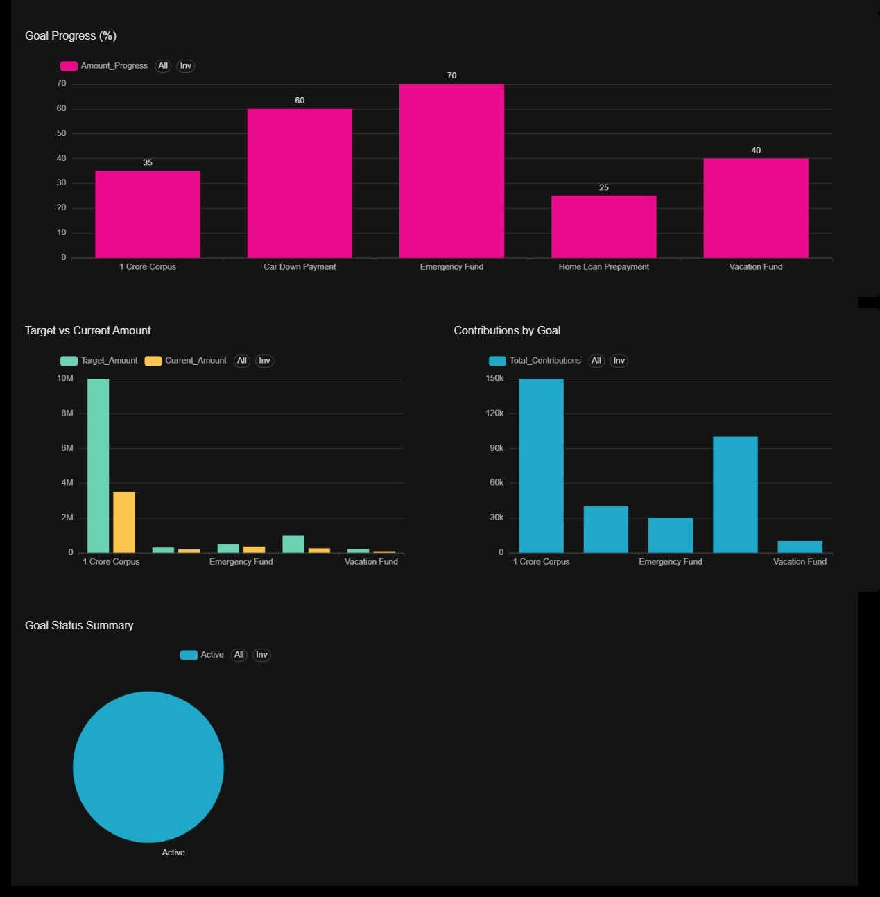

# Expense Board

A personal finance tracking dashboard built with Apache Superset, providing insights into cashflow, spending patterns, and goal progress.

---

## Quick Start

### Build and Run
```bash
# Build custom Superset image
docker build -t superset-custom .

# Start all services
docker compose up -d

# View logs
docker logs superset_app -f
```

## Access the dashboard:
> [http://localhost:8088/login/](http://localhost:8088/login/)

---

## Setup

### Initial Configuration (via terminal)
```bash
# Enter the container
docker exec -it superset_app bash

# Initialize the database
superset db upgrade

# Create admin user
superset fab create-admin \
  --username admin \
  --firstname Admin \
  --lastname User \
  --email admin@example.com \
  --password admin

# Initialize Superset
superset init

# Exit and restart
exit
docker restart superset_app
```

### Database Connection Settings

When adding/editing your database connection in Superset, check **Advanced → Security** settings:

- Uncheck **"Allow DDL"** and **"Allow DML"** if you want read-only access
- Ensure **"Allow this database to run non-SELECT statements"** matches your needs

---

## Common Operations

### Rebuilding from Scratch
```bash
docker compose down -v    # -v removes volumes
docker compose up -d --build
```

### Enable Async Queries
```bash
docker build -t superset-custom .
docker compose down
docker compose up -d
```

### Restart Services
```bash
docker restart superset_app superset_celery
```

---

## Debugging

### Reset Initialization Flag
```bash
docker exec -it superset_app rm -f /app/superset_home/initialized
docker restart superset_app
```

### Full Reset
```bash
docker compose down -v   # Removes all volumes
docker compose up -d
```

### Inspect Container
```bash
# Check uv installation
docker run --rm -it apache/superset:latest which uv

# List virtual environment binaries
docker run --rm -it apache/superset:latest ls -la /app/.venv/bin/
```

---

## Dashboard Features

| Feature | Description |
|---------|-------------|
| Monthly Cashflow Trends | Track income vs expenses over time |
| Category-wise Breakdown | Visualize spending by category |
| Payment Method Analysis | See which payment methods are used most |
| Goal Progress Tracking | Monitor progress toward financial goals |

### Included Files
```
├── dashboard/
│   └── expense_dashboard.json    # Superset dashboard export
├── Screenshots/
│   ├── Dashboard.jpg             # Main dashboard view
│   └── Goals.jpg                 # Goals tracking tab
└── README.md
```

---

## Screenshots

### Dashboard Overview


### Goals Tab


---


## Parse Statements

- Bank Statements
    - [] Kotak
    - [] Union
    - [] HDFC

- SIP statements
    - [] GROWW
    - [] KITE


- PhonePe Wallet statements
    - []


## License

MIT

